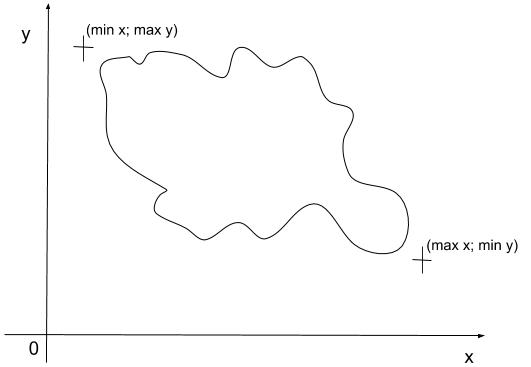

# get-region-delimitations
A module to get two points from a rectangle which contains all points.

[](https://travis-ci.org/cedced19/get-region-delimitations)

```
var example = [{lat:48.7436408996582,lng:7.2582902908325195},{lat:48.74357223510742,lng:7.2582526206970215},{lat:48.74335479736328,lng:7.258235931396484}];

var getRegionDelimitations = require('get-region-delimitations');

getRegionDelimitations(example, 'lat', 'lng');
```


